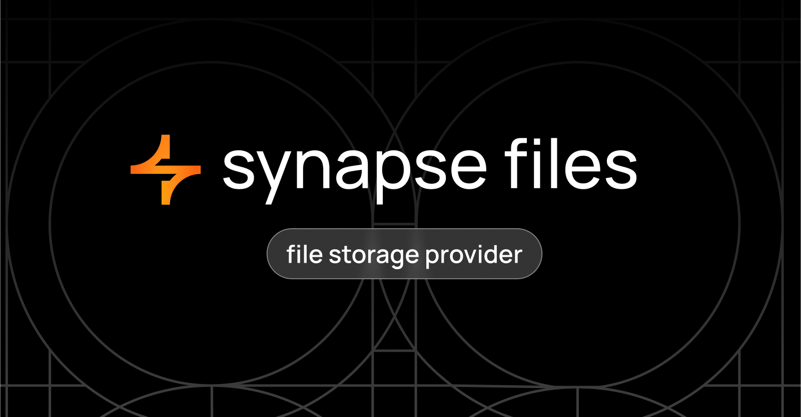

# File-sharing



---

An application designed for storing files with the capability to open them directly in a browser.

This application is developed using Django and the Django REST Framework.

---

## Installation and Setup

### 1. Clone the repository

```bash
git clone https://github.com/synapse-global/synapse-file-sharing.git
```

### 2. Navigate to the project directory

```bash
cd synapse-file-sharing
```

### 3. Create a .env file and add the necessary variables

```bash
cp .env.example .env
```

### 4. Build and run the Docker container

```bash
docker-compose up --build
```

### 5. Create an admin account

```bash
docker-compose exec web python manage.py createsuperuser
```

### 6. Download static files

```bash
docker-compose exec web python manage.py collectstatic
```

### 7. Access the site administration where all files are stored

In your browser, navigate to http://127.0.0.1:8025/admin/login/

Enter the admin username and password.

---

# Project Documentation

<details>
<summary style="font-weight: bold; font-size: large">
Models
</summary>

### [Files](core/models.py#L3) - Files

-   file - stores the files
-   key - a unique key for opening the file in the browser
-   name - the name of your file
</details>

<details>
<summary style="font-weight: bold; font-size: large">
Django Administration
</summary>

### [FilesAdmin](core/admin.py#L9) - File model administration

The `file_url` function generates a link using the file key, which can be used to view the file in the browser.

```python
def file_url(self, obj):
    url = settings.URL_ADMIN + str(obj.key)
    return mark_safe(f'<a href="{url}" target="_blank"> {url} </a>')
```

URL_ADMIN - the host where files will be opened

-   `readonly_fields` - non-editable fields
-   `fields` - fields displayed in the Django admin object of this model
-   `search_fields` - fields that can be used to search for files
-   `list_display` - fields displayed on the Django admin model page

</details>

<details>
<summary style="font-weight: bold; font-size: large">
Views
</summary>

### [get_file](core/views.py#L7) - Open file in browser

This function allows files to be opened directly in the browser.

</details>
